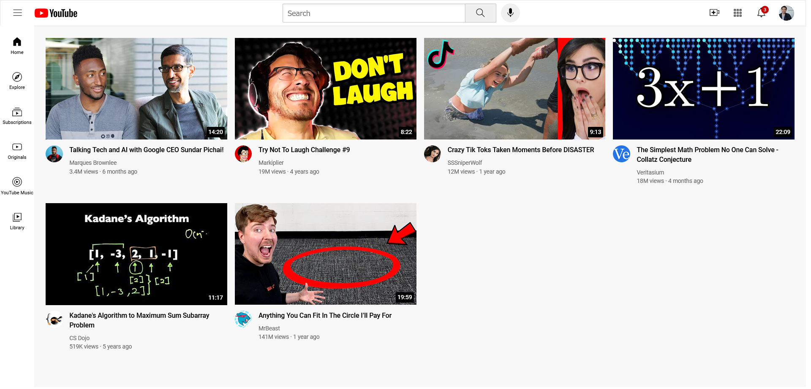

# YouTube UI Clone

A very simple clone of YouTube's UI (This is not functional at all)

## Table of contents

- [Overview](#overview)
  - [The challenge](#the-challenge)
  - [Screenshot](#screenshot)
  - [Links](#links)
- [My process](#my-process)
  - [Built with](#built-with)
- [Author](#author)
- [Acknowledgments](#acknowledgments)

## Overview

### The challenge

Users should be able to:

- See YouTube UI clone

### Screenshot

### Links

- Live Site URL: [https://quiel-youtube-ui-clone.netlify.app/](https://quiel-youtube-ui-clone.netlify.app/)

## My process

### Built with

- HTML5
- CSS3
- Sass

## Author

- GitHub - [quielLovesLasagna](https://github.com/quielLovesLasagna)

## Acknowledgments

I would like to thank **SuperSimpleDev** for the assets used in this project check it out [here](https://github.com/SuperSimpleDev/html-css-course-2022/tree/main/2-copy-of-code/lesson-17).
